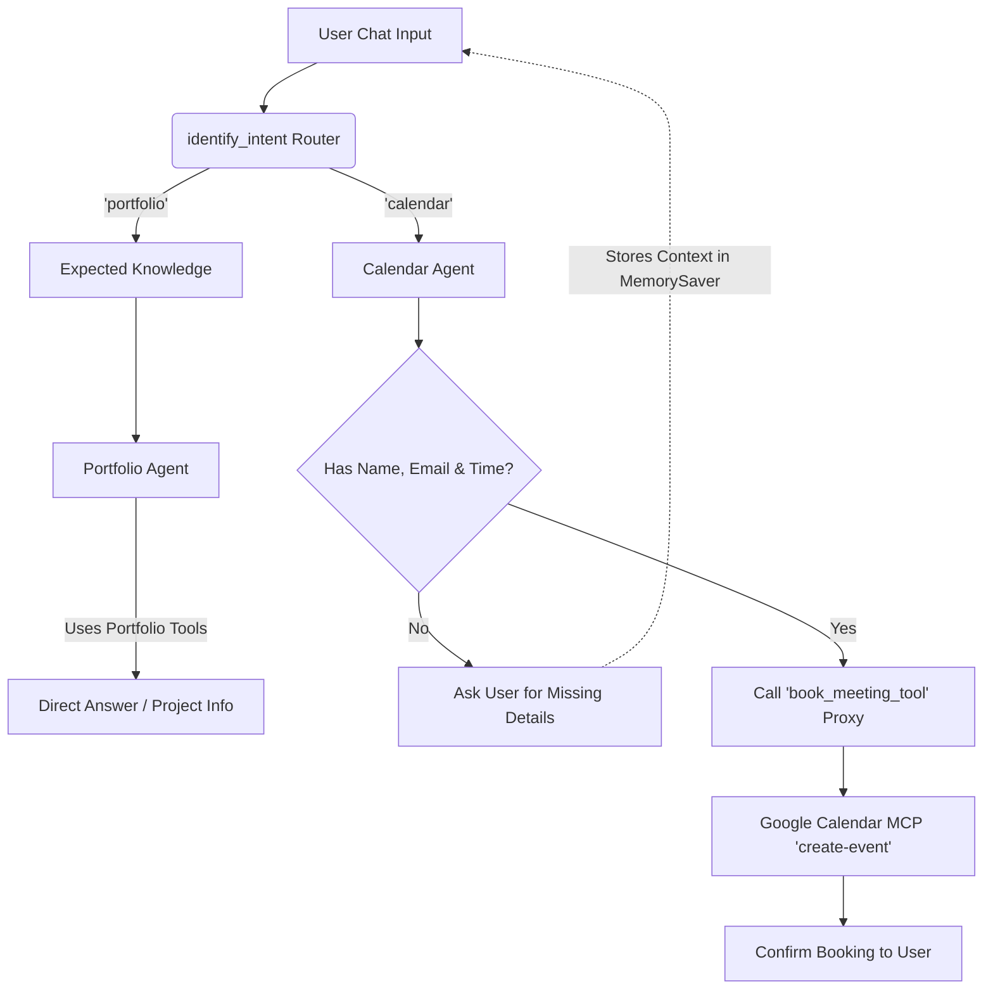

# Noir AI - Portfolio & Calendar Service

A multi-agent AI backend service built with FastAPI, LangGraph, and Google Calendar MCP. This service powers the "Noir AI" assistant, capable of intelligently routing queries between a static portfolio knowledge base and an interactive scheduling agent.

## Workflow Diagram

## Core Architecture & Features

- **LangGraph Orchestrator**: Uses an intelligent state graph router to detect intent and hand off the user's query to the most capable specialized agent.
- **Conversational Memory**: Integrated LangGraph `MemorySaver` tied to frontend-generated `session_id`s. This gives the AI short-term context allowing it to facilitate multi-turn flows (e.g. asking for missing booking information across multiple messages).
- **Google Calendar MCP**: Uses `langchain-mcp-adapters` to securely bind native Google Calendar capabilities (List, Create) to the AI system via stdio pipelines.
- **Resilient Tool Schemas**: To ensure smaller, high-speed LLMs (like `llama-3.1-8b`) do not fail on complex nested JSON validation, a Python-level proxy abstraction (`book_meeting_tool`) handles object mapping.

