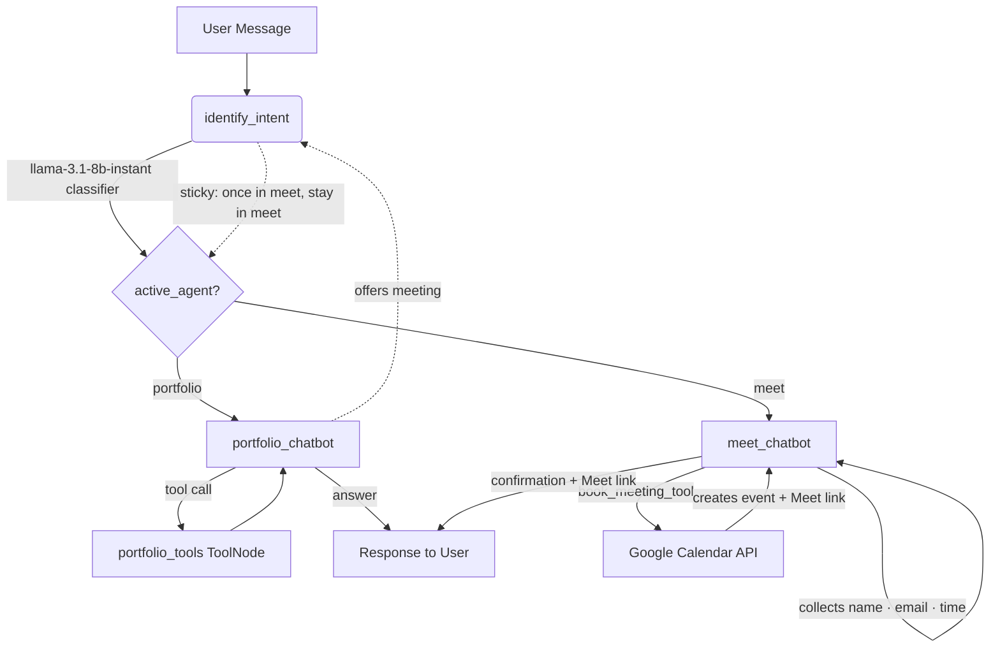

# Noir AI — Portfolio & Meeting Service

A multi-agent AI backend built with **FastAPI**, **LangGraph**, and the **Groq** inference API. It powers the "Noir AI" assistant — a premium personal concierge that showcases Mudasir Shah's portfolio and books real Google Calendar meetings with an auto-generated Google Meet link.

## Workflow


```mermaid
flowchart TD
    A[User Message] --> B(identify_intent)
    B -->|llama-3.1-8b-instant classifier| C{active_agent?}

    C -->|portfolio| D[portfolio_chatbot]
    D -->|tool call| E[portfolio_tools ToolNode]
    E --> D
    D -->|answer| Z[Response to User]

    C -->|meet| F[meet_chatbot]
    F -->|collects name · email · time| F
    F -->|book_meeting_tool| G[Google Calendar API]
    G -->|creates event + Meet link| F
    F -->|confirmation + Meet link| Z

    B -. sticky: once in meet, stay in meet .-> C
    D -. offers meeting .-> B
```

## Architecture

| Layer | Detail |
|---|---|
| **API** | FastAPI on port 8000 — `/chat` (POST) and `/health` (GET) |
| **Orchestration** | LangGraph `StateGraph` with `MemorySaver` keyed by `session_id` |
| **Intent router** | `llama-3.1-8b-instant` (fast, cheap); 4-priority rule chain before LLM call |
| **Portfolio agent** | `llama-3.3-70b-versatile` + 5 pure-Python tools (profile, projects, availability, job-fit) |
| **Meet agent** | `llama-3.3-70b-versatile` + `book_meeting_tool` + calendar read tools |
| **Booking** | Direct `google-api-python-client` call — no subprocess, no extra MCP server |
| **Google Meet link** | Auto-generated via `conferenceDataVersion=1` on the Calendar insert |
| **OAuth** | Reads token from `~/.config/google-calendar-mcp/tokens.json`; auto-refreshes and persists on expiry |
| **Memory** | Last 12 messages per agent call (keeps token usage bounded) |

## Key Features

- **Sticky meet routing** — once the user enters the booking flow, the router stays in `meet` until all details are collected and the calendar event is created.
- **Affirmative detection** — replying "yes", "sure", "ok" etc. to a meeting offer seamlessly hands off to the meet agent.
- **Working-hours guard** — rejects bookings outside 9 AM – 6 PM PKT and asks for a different time.
- **Conflict check** — queries the calendar before inserting; surfaces clashes to the user.
- **Token auto-refresh** — stale OAuth tokens are refreshed silently and saved back to disk.
- **Friendly error messages** — rate limits and API errors are translated into plain-English responses.

## Project Structure

```
ai-service/
├── main.py              # FastAPI app, /chat and /health endpoints
├── orchestrator.py      # Lazy graph init, session routing, error handling
├── graph.py             # LangGraph state graph, all agents, tools, routing logic
├── calendar_mcp.py      # Google Calendar MCP client (list-calendars, list-events)
├── credentials.json     # Google OAuth client credentials (not committed)
├── tools/
│   ├── implementation.py  # Portfolio data (profile, projects, availability)
│   └── schemas.py         # Shared type definitions
└── package.json         # Node dependency for @cocal/google-calendar-mcp
```

## Setup

### 1. Install dependencies

```bash
pip install -r requirements.txt
npm install
```

### 2. Configure environment

Create a `.env` file:

```env
GROQ_API_KEY=your_groq_api_key
GROQ_MODEL=llama-3.3-70b-versatile
```

Place your Google OAuth client credentials at `credentials.json` (download from Google Cloud Console — OAuth 2.0 Client ID, type **Desktop app**).

### 3. Authorise Google Calendar (first run only)

```bash
$env:GOOGLE_OAUTH_CREDENTIALS = "./credentials.json"
node node_modules/@cocal/google-calendar-mcp/build/auth-server.js
```

This opens a browser. Complete the OAuth flow — tokens are saved to `~/.config/google-calendar-mcp/tokens.json` and auto-refreshed on expiry.

### 4. Start the server

```bash
python -m uvicorn main:app --port 8000 --host 127.0.0.1
```

### 5. Re-authenticate (if token is revoked)

Run step 3 again — it will detect the invalid token and open a fresh consent screen.

